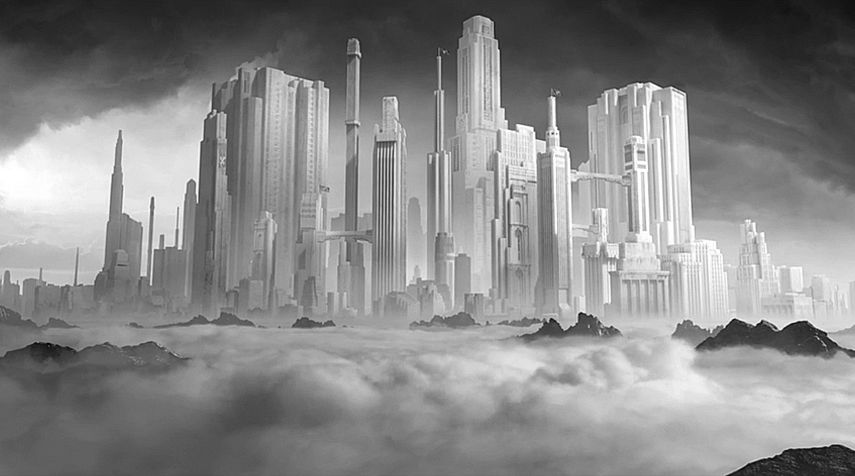
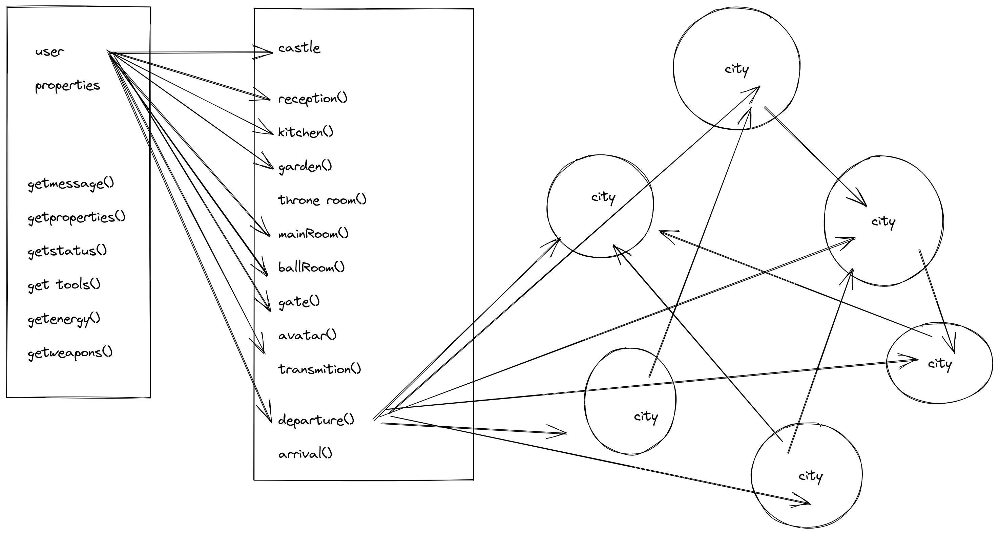

# * USER or CASTLE 
### *title still in process
## game developer project 

user or Castle is a project that I started to develop as the final project of programing fundamentals from DCI - digital career Institute in Berlin, Germany. 

My first idea was to develop a story telling game: a book that has a dramaturgy that the reader interacts with. This project was developed until the end of the castle. Cities have not been developed neither Inter-activities like challenges with other characters, or users. My wish is one day to translate this project to DOM language and to further develop into the game world. 

If you want to see more about other project:

[Ivo Serra github repository](https://github.com/ivoserra).

## the story
User or Castle is a story game where the consumer takes decisions through multiple choices developing different outcomes or dramaturgies. The goal of this game is that the user is able to return to the castle and can sum up all what he could gather from is adventures. If the sum is higher then expected the user will have access to the throne room and clammed as a hero within a multitude of heros of the Castle.
 

 

## Castle 

The Castle is a secret place where all users arrive before they are assigned their avatar identities so they can proceed into their journeys and missions. 
In the castle the user has to go through several rooms, each room has conditions to which the user has go through so he can earn and gather properties, values, energy, etc... that will help on its mission. when the user gets all the necessary attributes, he then creates an avatar and assigns it to a mission to which e needs to go too.  
  

## Cities

Cities are locations on a Multi-diverse universe.
To be able to arrive to each city the user must have an avatar and hide is true-identity. The castle  should never be revealed to no one.
Cities are challenging places, for example, users can challenge other users for whatever challenge might be designed by its location within the city. In every location the User can get more properties and points but he can also loose them even being deported from the city or erased from the story.
  

## Initial game structure 

## the code-story

For this project I have developed 2 classes , one of the classes needs to assign into the other class methods.
In every every assignment there is a automatic message on the node Terminal , where one can read the story and directions.
  

  

### Images used for this project are from the artist woodkid to which I have as a bigger reference, not only for its visual but for his music and art.
